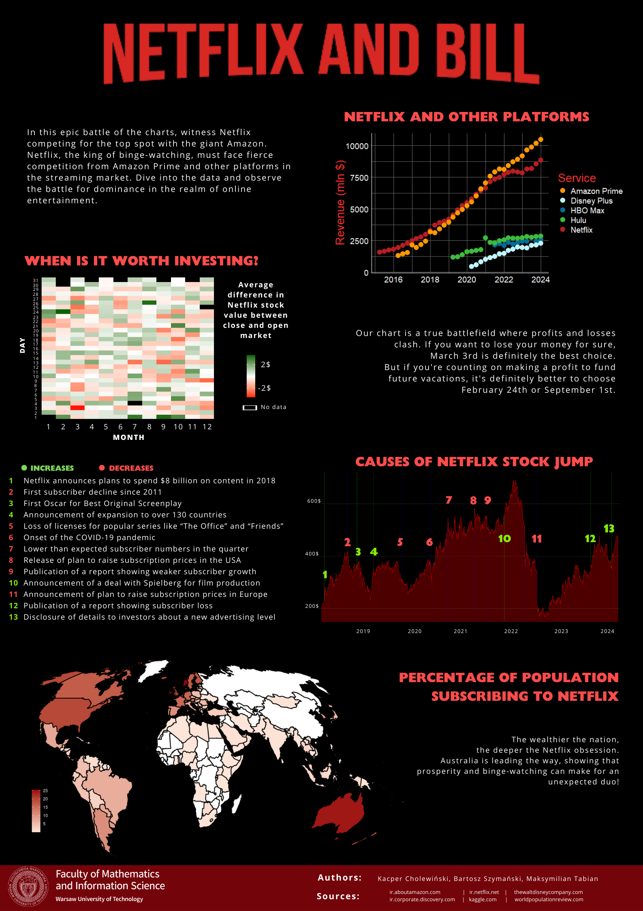

## Netflix and bill

The poster presents Netflix's financial situation in the market, focusing on the analysis of key financial indicators and trends of this global streaming media powerhouse. It showcases major financial data and subscriber numbers, alongside significant information about competitors and future forecasts. The project aims to illustrate Netflix's current market position and understand its strategy and prospects for financial development.

## Authors
- Kacper Cholewiński
- Bartosz Szymański
- Maksymilian Tabian.

## Used technologies
- R (dplyr, ggplot, tidyr, maps, mapdata)
- Canva

## Data sources
- [Dataset 1](https://www.kaggle.com/datasets/ranugadisansagamage/netflix-stocks)
- [Dataset 2](https://worldpopulationreview.com/country-rankings/netflix-users-by-country)
- [Dataset 3](https://ir.aboutamazon.com/overview/default.aspx)
- [Dataset 4](https://ir.netflix.net/ir-overview/profile/default.aspx)
- [Dataset 5](https://thewaltdisneycompany.com/)
- [Dataset 6](https://ir.corporate.discovery.com/investor-relations/default.aspx)

## Final effect

